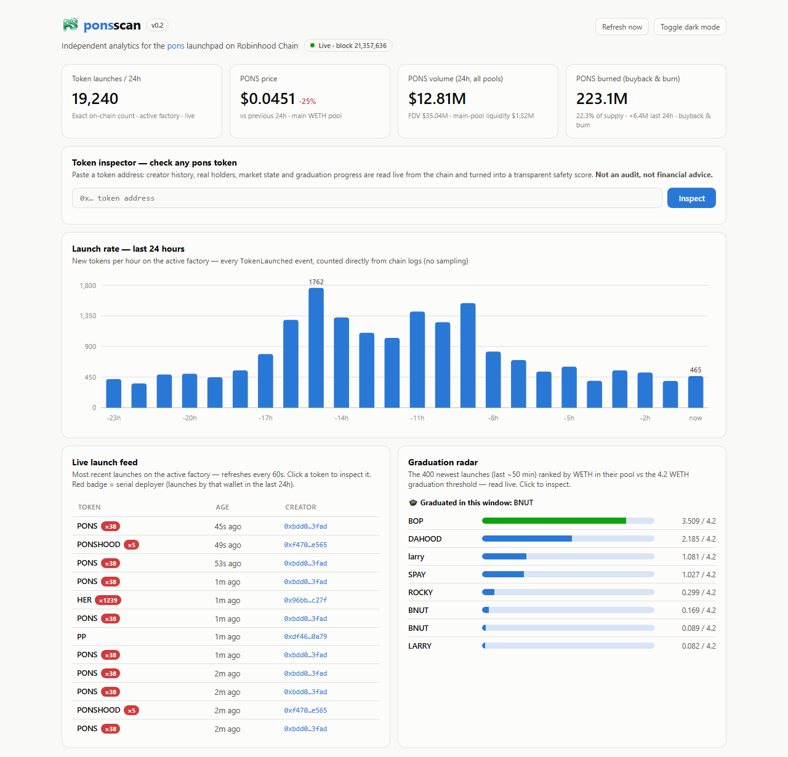

#  PonsScan

Independent analytics & safety dashboard for the [pons](https://ponsfamily.com) launchpad on **Robinhood Chain** — a single self-contained HTML file that reads the chain directly from your browser. No backend, no API keys, no wallet connection.

## Features

- **🔍 Token inspector (rug-check)** — paste any token address and get: creator + their serial-launch history, real (non-pool) holder count, market state, graduation progress and a transparent 0–100 safety score with every factor spelled out
- **📊 Exact launch rate** — every `TokenLaunched` event from the last 24h counted straight from chain logs (no sampling, no extrapolation), bucketed per hour
- **⚡ Live launch feed** — newest launches with age and creator; serial deployers get a red ×N badge; click any token to inspect it
- **🎓 Graduation radar** — the newest launches ranked by WETH accumulated in their pool vs the 4.2 WETH graduation threshold, plus tokens that just graduated
- **🔥 PONS burn tracker** — total PONS in the burn address (buyback & burn), % of supply, and how much was burned in the last 24h
- **👥 Creator concentration** — distinct creators, top-deployer share and serial-wallet counts over the full 24h window
- **💰 PONS token metrics** — price, volume, liquidity, FDV across pools

## How it works

Everything runs client-side:

- **Robinhood Chain RPC** (`rpc.mainnet.chain.robinhood.com`) — `TokenLaunched` logs, WETH pool balances, burn-address balance, token metadata via `eth_call` (CORS-open, batched, rate-limit-aware with backoff)
- **DexScreener API** — prices, volumes, liquidity
- **Blockscout API** — token holder lists
- Contract addresses & event signatures from [docs.ponsfamily.com](https://docs.ponsfamily.com)

The launch feed refreshes every 60s, market/burn/radar data every 5 minutes, and the full 24h scan every 30 minutes. If the RPC is unreachable, the page falls back to a baked-in snapshot (the pill in the header shows which mode is active).

## Safety score

Rule-based and fully transparent: base 50 · single-launch creator +20, repeat −5, serial (≥5 in window) −25 · actively traded +10, quiet +5, not indexed −10 · ≥3 real holders +15, 1–2 +5, zero holders despite >$1K volume −30 (wash-trading signal) · graduated +10. Clamped to 5–95.

It is a **heuristic screen, not a contract audit**, and nothing here is financial advice.

## Roadmap (v1)

- Full event indexer (all launches since factory deploy, both factories)
- Public REST API + WebSocket stream
- Full per-creator history (beyond the ~28h log window) and calibrated scoring
- Graduation alerts

## Disclaimer

Independent community project — not affiliated with pons or Robinhood. The safety score is a heuristic screen, **not** a contract audit. Nothing here is financial advice.
